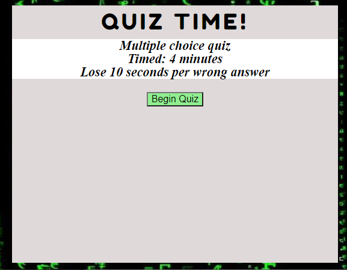

# QUIZ TIME

## Link

[Coding Quiz](https://cnmiller127.github.io/Coding-Quiz/)

## Quiz Information

- This is a multiple choice quiz on coding
- 4 minutes to complete
- 10 seconds will be removed from timer for incorrect answers

## Code

- Used object array for answer text and boolean value
- Score updated after each question 
- Click events used for buttons
- User can only input initials once after taking quiz
- Used local storage to save test scores
- Clear button provided to clear storage

## Preview

<<<<<<< HEAD

=======

>>>>>>> 5d0ce2b76cf6de76bb4290e08461401754d45bcb
